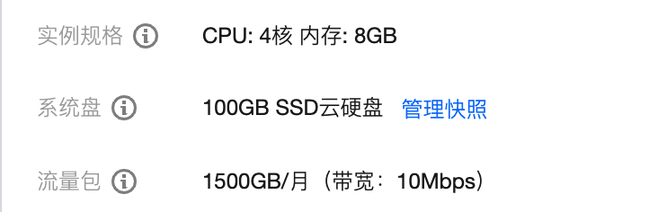
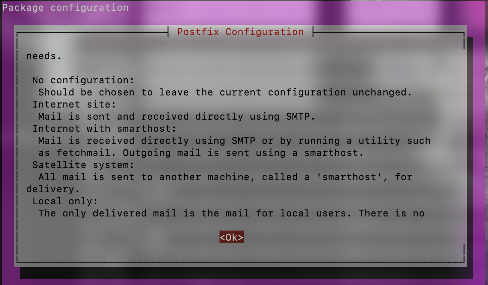
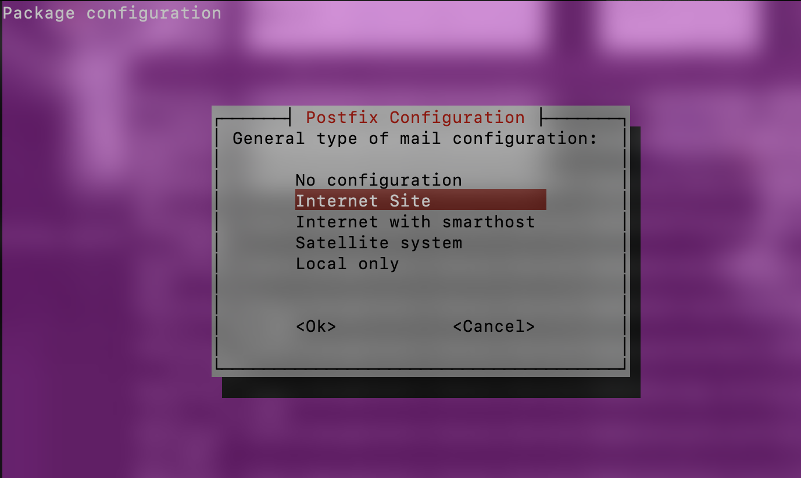
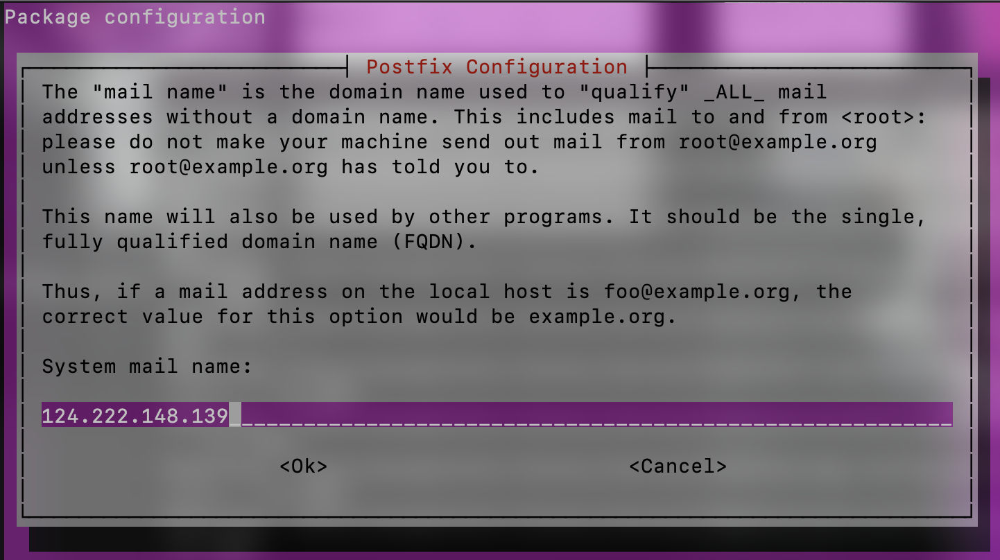
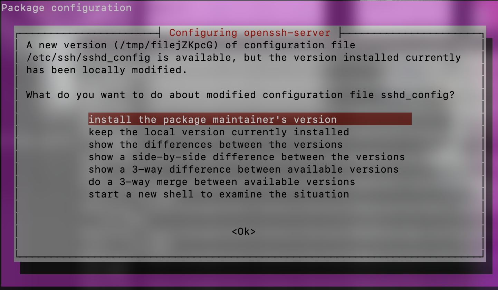
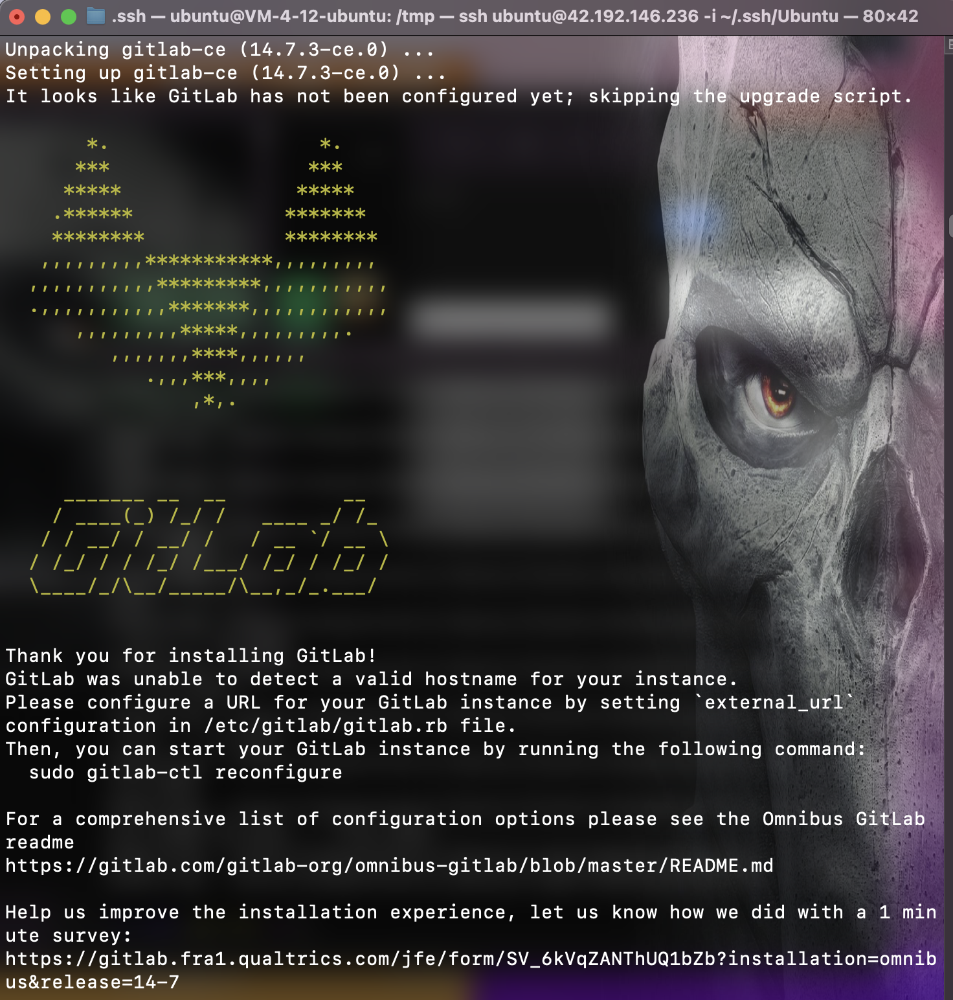
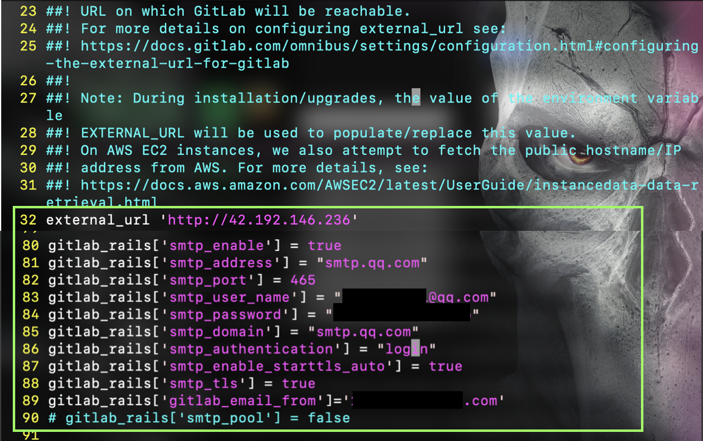
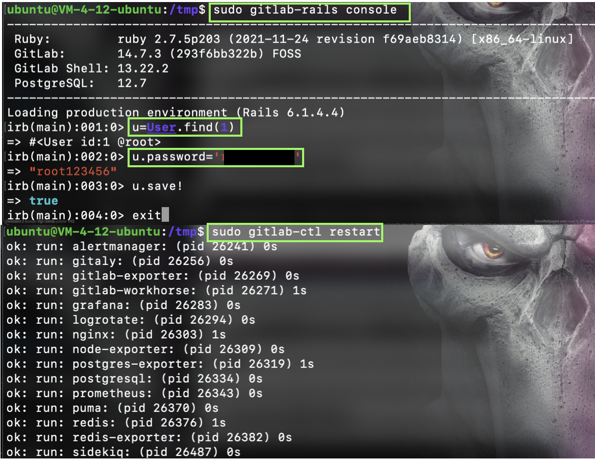
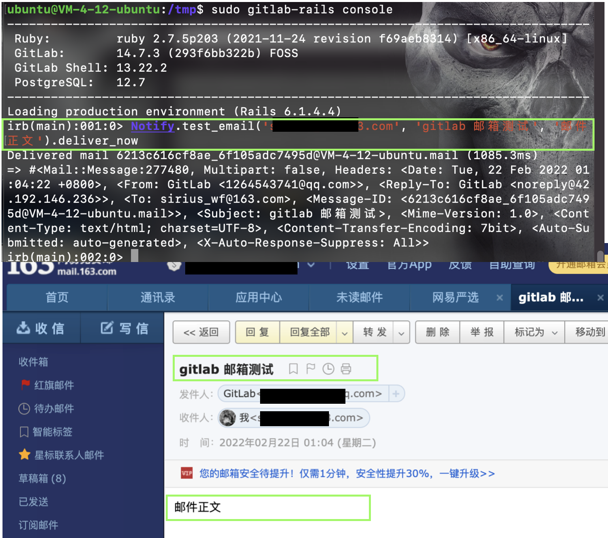

?> 本文将介绍gitlab-ce 安装与配置

基础环境：腾讯云轻量服务器



# 安装 Gitlab-ce

## 1. 安装依赖项
```shell
sudo apt update
sudo apt install ca-certificates curl openssh-server postfix
```

**配置postfix**





## 2. 安装Gitlab-ce

```shell
cd /tmp
curl -LO https://packages.gitlab.com/install/repositories/gitlab/gitlab-ce/script.deb.sh
sudo bash /tmp/script.deb.sh
```

**配置国内加速镜像**

```shell
sudo vim /etc/apt/sources.list.d/gitlab_gitlab-ce.list
```

```txt
deb https://mirrors.tuna.tsinghua.edu.cn/gitlab-ce/ubuntu focal main
deb-src https://mirrors.tuna.tsinghua.edu.cn/gitlab-ce/ubuntu focal main
```

```shell
sudo apt update
sudo apt install gitlab-ce
```



## 3. 配置Gitlab

```shell
sudo vim /etc/gitlab/gitlab.rb
```



```txt
  32 external_url 'http://your public ip or hostname'
  80 gitlab_rails['smtp_enable'] = true
  81 gitlab_rails['smtp_address'] = "smtp.qq.com"
  82 gitlab_rails['smtp_port'] = 465
  83 gitlab_rails['smtp_user_name'] = "1264543741@qq.com"
  84 gitlab_rails['smtp_password'] = "you authorization code"
  85 gitlab_rails['smtp_domain'] = "smtp.qq.com"
  86 gitlab_rails['smtp_authentication'] = "login"
  87 gitlab_rails['smtp_enable_starttls_auto'] = true
  88 gitlab_rails['smtp_tls'] = true
  89 gitlab_rails['gitlab_email_from']='you qq account@qq.com'
  90 # gitlab_rails['smtp_pool'] = false
```

**配置个人QQ邮箱作为Gitlab邮箱，请参照如下文档**
[记一次gitlab添加用户收不到邮件的解决办法](https://cloud.tencent.com/developer/article/1111933)


## 4. 配置Gitlab 管理员账户密码

```shell
sudo gitlab-rails console
u=User.find(1)
u.password='your root password'
u.save!
exit
sudo gitlab-ctl restart
```



## 5. 测试邮箱配置

```shell
sudo gitlab-rails console

Notify.test_email('deliver to', 'gitlab 邮箱测试', '邮件
正文').deliver_now
```




Notify.test_email('test email', 'gitlab 邮箱测试', '邮件正文').deliver_now 

## 6. 参考资料

- [Ubuntu 20.04安装配置GitLab](https://blog.csdn.net/qq_35844177/article/details/106876923)
- [GitLab服务器修改管理员用户root密码](https://blog.csdn.net/w544924116/article/details/118876468)
- [记一次gitlab添加用户收不到邮件的解决办法](https://cloud.tencent.com/developer/article/1111933)