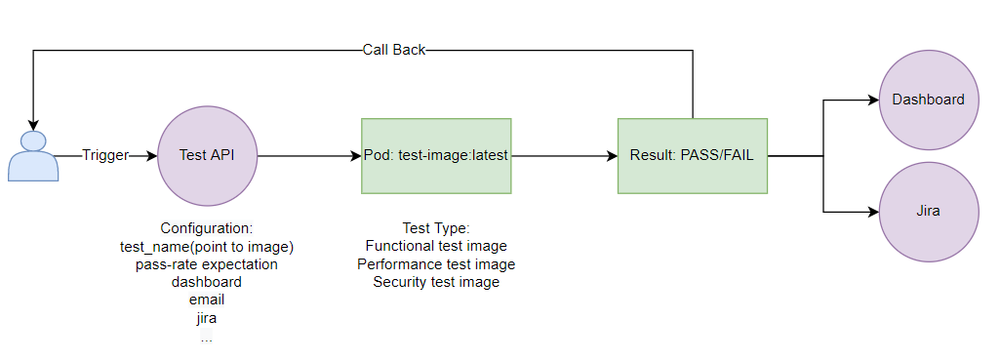
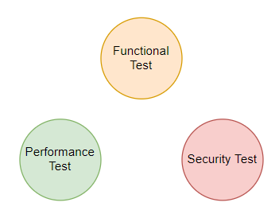

# All tests triggered by an API

Tests scripts are separated projects which were built as an image 

## Test Type:


## API configurations

```
test_name: used to locate the image
pass-rate expectation: for example, the pass-rate reaches 80%, we may mark it as PASS
dashboard: contains a set of config to locate target dashboard
update to dashboard config
jira: contains a set of config to locate jira test cycle
email_to:
email_cc:
log_attach: attached the execution log

```
